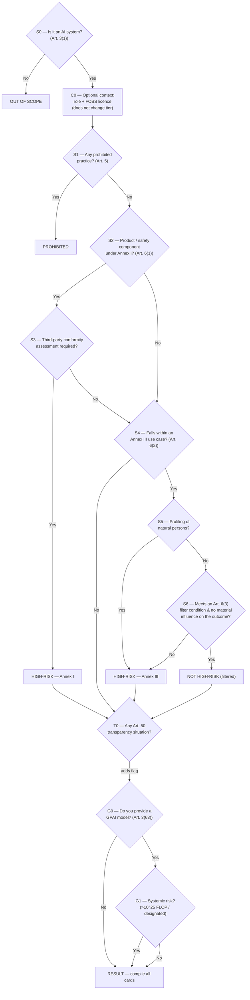

# Build spec — EU AI Act Risk-Tier Self-Assessment Tool

> **For the AI coding agent (e.g. Claude Code):** This document is a complete build brief. It is paired with `decision-tree.json`, which is the single source of truth for all questions, branching logic, reference lists (Annex III, Annex I, prohibited practices, Article 50 triggers) and result cards. **Do not hard-code the classification logic in your UI** — load it from `decision-tree.json` and drive the interface from it, so the content can be updated without touching the code. Read this spec end-to-end before writing code. Everything is in English (the tool's output language).

---

## 1. Goal and audience

Build an **online, browser-based self-assessment tool** that lets the owner of an algorithm or AI application answer a short series of questions and find out **which risk category of the EU AI Act (Regulation (EU) 2024/1689) their system falls into**.

The tool must cover the **full set of AI Act tiers**:

- **Out of scope** — not an AI system under Art. 3(1)
- **Prohibited** — unacceptable risk (Art. 5)
- **High-risk via Annex I** — Art. 6(1), regulated products
- **High-risk via Annex III** — Art. 6(2), listed use cases
- **Not high-risk (filtered)** — Annex III use case but exempted by the Art. 6(3) filter
- **Limited risk / transparency** — Art. 50 (cumulative with the tier above)
- **Minimal risk** — no mandatory obligations
- **GPAI model** and **GPAI model with systemic risk** — Art. 51–55 (a separate, model-level overlay)

Primary users are **non-lawyer product owners, compliance officers and developers** at organisations that build or deploy AI. The tone is plain, practical and reassuring, but every screen must be legally precise and cite the relevant article.

This is a **decision-support / triage tool, not legal advice.** The disclaimer (Section 9) must be visible.

---

## 2. Why this is not a single linear tree

A common mistake is to model the AI Act as one path ending in one leaf. It isn't. A single system can carry **three independent statuses at once**:

1. a **primary risk tier** (the SPINE),
2. **transparency obligations** under Art. 50 (cumulative — they sit on top of high-risk, filtered, or minimal), and
3. a **GPAI model status** (independent — a model can be a GPAI model *and* the system built on it can be high-risk).

On top of these, two **context flags** — `role` (provider / deployer / both) and `fossLicence` (open-source or not) — are captured in an optional first step. They **never change the tier**; they only tailor *which obligations are shown* and *whether the FOSS note appears*.

So the tool accumulates **flags** as the user progresses and, at the end, renders **every applicable result card**, with obligations filtered/high-lighted by role. This structure is defined in `decision-tree.json → resultModel`, `moduleOrder`, `crossLinks` and `notes`.

The flow runs five modules in order: **CONTEXT → SPINE → TRANSPARENCY → GPAI → RESULT**, with two short-circuits: if the system is *not an AI system* it stops immediately; if it is *prohibited* the tier spine stops (prohibited overrides everything, including any FOSS licence).

**Fewer questions via cross-links.** Some answers imply later ones. If the user selects **biometric categorisation (Annex III 1(b))** or **emotion recognition (1(c))** in the spine, the tool **auto-derives** the Art. 50(3) transparency duty and does not ask it again. These inference rules live in `decision-tree.json → crossLinks` and must be applied by the implementer.

---

## 3. The decision flow

### 3.1 Diagram



### 3.2 The SPINE, step by step

The node IDs below map exactly to `decision-tree.json → nodes`.

0. **C0 — Optional context (`type: "context"`).** After S0 confirms it is an AI system, offer one skippable screen with two dropdowns: **role** (provider / deployer / both / not sure) and **FOSS licence** (yes / no / not sure). Store as `flags.role` and `flags.fossLicence`. This screen does **not** branch and does **not** change the tier; it only tailors the result. Render its two `fields[]` from the node.

1. **S0 — Is it an AI system? (Art. 3(1)).** The gate. The decisive element is *inference*: the system derives outputs (predictions, content, recommendations, decisions) from input, rather than executing only rules defined solely by humans. Show the `help.likelyYes` / `help.likelyNo` lists and the `ai_system_definition` guideline link. **No → OUT_OF_SCOPE** (stop); **Yes → C0**.
2. **S1 — Prohibited practice? (Art. 5).** Present the eight prohibited practices from `catalog.prohibitedPractices`. Any match → **PROHIBITED** (stop the tier spine).
3. **S2 — Annex I product or safety component? (Art. 6(1), first condition).** Is the AI itself a regulated product, or a safety component of one, under Annex I harmonisation legislation? Use `catalog.annexI_legislation` as a prompt list and explain the Art. 3(14) safety-component test (failure endangers health/safety, **or** fulfils a safety function; comfort/efficiency alone is not a safety function). **No → S4.**
4. **S3 — Third-party conformity assessment required? (Art. 6(1), second condition).** Both conditions are cumulative. If the product only needs internal self-assessment, it is **not** high-risk under Art. 6(1). **Yes → HIGH_RISK_ANNEX_I; No → S4.**
5. **S4 — Annex III use case? (Art. 6(2)).** Present all eight areas and their specific use cases from `catalog.annexIII`. Only the *listed use cases* count, not the broad area. Surface the horizontal notes ('natural persons' limitation, 'on behalf of', 'in so far as permitted…') and the reminder that emotion recognition / biometric categorisation may be *prohibited* rather than high-risk. **When a selected use case carries `impliesTransparency` (1(b), 1(c)), record those Art. 50 items now** so they are pre-filled and skipped in T0. **No → T0** (transparency check).
6. **S5 — Profiling of natural persons?** If yes, the system is **always** high-risk and cannot use the filter → **HIGH_RISK_ANNEX_III.**
7. **S6 — Art. 6(3) filter.** The system is *not* high-risk if it meets at least one of the four conditions in `catalog.filterConditions` **and** does not materially influence the outcome (and is not part of a complex/agentic setup that does). **Yes → NOT_HIGH_RISK_FILTERED; No → HIGH_RISK_ANNEX_III.**

### 3.3 The TRANSPARENCY module (Art. 50)

**T0** runs for every non-prohibited, in-scope system (including high-risk ones). Present the four Art. 50 triggers from `catalog.transparencyTriggers` as a multi-select. **Any item auto-derived at S4 (via `crossLinks`) is shown pre-ticked and read-only** — the user only answers the remaining items, so an emotion-recognition or biometric-categorisation system never gets asked the Art. 50(3) question twice. Each trigger item carries a `role` (provider or deployer) and an `example`; show both. If any item is set, the `transparency` flag holds the list of triggered items; these obligations are **cumulative** with the primary tier. (Optional nicety: if the user ticks 50(4) deep fakes, hint that 50(2) likely also applies — see `crossLinks:deepfake-implies-synthetic`.)

### 3.4 The GPAI module (Art. 51–55)

**G0** asks whether the user provides a general-purpose AI *model* (Art. 3(63)). If yes, **G1** asks about systemic risk (Art. 51: high-impact capabilities, presumed above 10^25 FLOP training compute, or Commission designation). Set the `gpai` flag to `gpai_model` or `gpai_model_systemic`. This is **independent** of the system tier — show it alongside whatever the SPINE produced.

### 3.5 RESULT

Compile the accumulated flags and render **all** applicable cards from `outcomes`:

- always the `primaryTier` card (one of OUT_OF_SCOPE / PROHIBITED / HIGH_RISK_ANNEX_I / HIGH_RISK_ANNEX_III / NOT_HIGH_RISK_FILTERED / MINIMAL_RISK);
- the `TRANSPARENCY` card **iff** the transparency flag is set and the tier is not out_of_scope/prohibited;
- the `GPAI_MODEL` or `GPAI_MODEL_SYSTEMIC` card **iff** the gpai flag is set.

**Deriving MINIMAL_RISK:** if the SPINE reached T0 without a high-risk or filtered outcome (i.e. S4 = No), the primary tier is `MINIMAL_RISK` **unless** the transparency flag is set — in which case the primary tier is still minimal but the transparency card is added. (Transparency is an overlay, not a tier; show MINIMAL_RISK + TRANSPARENCY together.)

---

## 4. Data contract (`decision-tree.json`)

| Key | What it is | How the UI uses it |
|---|---|---|
| `meta` | Title, version, changelog, regulation, purpose, disclaimer, key dates | Header, footer, about box, disclaimer banner |
| `guidelines` | Registry of official Commission guideline links, keyed (e.g. `prohibited_practices`, `gpai_scope`, `transparency`), each `{title, url, status}` | Resolve every `guidelineLinks[]` key to a clickable "Official guidance" link on that screen/card |
| `notes` | `fossExemption` and `providerVsDeployer` explanatory notes, keyed | Rendered where an outcome's `showNotes[]` (or a context flag) calls for them |
| `meta.languageStyle` | The three-layer plain-language rule + tone | Governs how every screen is rendered (Section 5.5) |
| `resultModel` | Six result dimensions (`primaryTier`, `transparency`, `gpai`, `role`, `fossLicence`, `reviewFlags`) + short-circuit rules | The accumulation/compile logic |
| `moduleOrder` | `["CONTEXT","SPINE","TRANSPARENCY","GPAI","RESULT"]` | Module sequencing |
| `crossLinks` | Inference rules (`rules[]` with `when`/`then`/`refs`) | Auto-derive transparency, skip duplicate questions, show reminders |
| `nodes` | Every node keyed by ID. Question nodes: plain `text` + `explainer`, `legalText` `{articleRef, text}` (the "in the words of the law" panel), `help`, `articleRef`, `guidelineLinks[]`, `options[]` (`label`/`value`/`next`, optional `setsGpai`, optional `flagsReview`+`reviewNote`), optional `checklist`/`reference`, `setsFlag`, `prefillFrom`. Context node (`type:"context"`): `optional`, `fields[]` (each with plain `label`, `options[]`, `setsFlag`) and a single `next` | Renders each screen; `next` is a node ID or an outcome ID |
| `outcomes` | Result cards keyed by ID: `tier`, `color`, plain `title` + `summary`, `obligations[]` (each `{role, text}`), `legalRefs[]`, `guidelineLinks[]`, optional `showNotes[]` | Result screen cards; **filter/high-light `obligations` by `flags.role`** |
| `catalog.prohibitedPractices` | The 8 Art. 5 practices, each with `plain` (visible) + `label`/`ref` (exact wording on expand) | S1 checklist |
| `catalog.annexI_legislation` | Annex I Section A + B prompt list | S2 reference panel |
| `catalog.filterConditions` | The 4 Art. 6(3) conditions, each with `plain` + `label`/`detail` | S6 checklist |
| `catalog.transparencyTriggers` | The 4 Art. 50 situations, each with `plain`, `label`, `role`, `obligation`, `example`, `autoDerivedFrom` | T0 multi-select |
| `catalog.annexIII` | 8 areas, each `useCases[]` carrying `plain` + `label` (some with `impliesTransparency`) + horizontal notes | S4 selection panel |

**Colours** in `outcomes[].color`: `grey` (out of scope), `red` (prohibited), `orange` (high-risk), `yellow` (filtered), `green` (minimal), `blue` (transparency), `purple` (GPAI). Map these to an accessible palette.

**Guideline links (required).** Every question node and result card carries a `guidelineLinks[]` array of keys into `guidelines` (or `notes`). Render each as a clearly-labelled "Official guidance ↗" link, and mark the high-risk one as *draft* (its `status`). This is the colleague-requested addition: prohibited, high-risk, transparency and GPAI screens all now link to the relevant official guideline, and the GPAI and transparency items carry worked `example`s like the Annex III cases do.

---

## 5. UX requirements

- **One question per screen**, with a phase-based progress indicator (see **Section 5.1**, which is required) and a clear Back button. Keep the whole assessment to well under a dozen clicks for a typical system.
- Every screen shows **three layers** (see Section 5.5): (1) the plain-language question `text` + `explainer` — always visible; (2) an **"In the words of the law"** collapsible holding `node.legalText` (near-verbatim regulation wording + its `articleRef`) — collapsed by default; (3) an **"Examples / how to decide"** collapsible holding `help.likelyYes` / `help.likelyNo` — collapsed by default. A small article-reference chip stays visible.
- **S1, S4, S6, T0 are list/checklist screens.** Render each catalog item's plain summary (`item.plain`) as the visible line, with the exact legal wording (`item.label`) and reference (`item.ref`) available on expand. For S4 (Annex III) group by the eight areas and let the user expand each; selecting any use case = "Yes". For T0 allow multiple selections.
- **"I'm not sure" is a real, data-level answer.** Judgement-heavy questions (S0, S2, S3, S4, S5, S6, G0, G1) carry an explicit `"I'm not sure"` option in `options[]`, with `flagsReview: true` and a `reviewNote`. Selecting it routes conservatively (toward keeping more obligations in view) and appends `{node, note}` to `flags.reviewFlags`, which the result screen shows in a **"Worth double-checking with an expert"** box. It never changes the tier by itself.
- **Result screen**: show all applicable cards, colour-coded, each with title, summary, the obligations list, legal references, and the relevant application date. Add a "what this means / next steps" note and prominent links to the AI Act Service Desk.
- **Answer trail**: show the path taken (question → answer) so the result is explainable and auditable.
- **Export**: let the user download a PDF/printable summary of their answers + result (useful evidence for the Art. 6(4) documentation duty in the filtered case). No account, no server storage.
- **Restart / edit answers** without losing earlier ones.

### 5.1 Progress visualisation (required)

**Design principle: anchor progress to the four phases, never to a question count.** The flow is branching and variable-length (an "out of scope" answer ends after one question, "prohibited" after two, a full run passes through the spine plus the transparency and GPAI overlays). A "step 3 of 10" bar or a percentage would be dishonest because the total is not fixed. Use the three components below together.

**A. Phase stepper (top of every screen).** A horizontal rail of four segments mapped 1:1 to `moduleOrder`:

1. *Scope & prohibitions* (nodes S0, S1)
2. *Risk tier* (nodes S2, S3, S4, S5, S6)
3. *Transparency* (node T0)
4. *GPAI* (nodes G0, G1)

Each segment has three states: **upcoming** (muted/outline), **current** (accent colour + subtle pulse or fill animation), **done** (filled + check icon). Derive the current segment from the active node's `module` field, which is present on every node in the JSON. Fill a segment the moment its last node is answered. When a short-circuit ends the run early (out of scope, prohibited), mark the remaining segments as *skipped* (a distinct greyed style with a small "n/a" label) rather than leaving them blank, so the user understands why the flow stopped. Keep the stepper compact on mobile (icons + short labels, or a collapsed "Phase 2 of 4: Risk tier" line).

**B. Live "verdict-so-far" panel (side panel on desktop, collapsible drawer on mobile).** This is the engagement driver: the user watches their own result take shape. Drive it entirely from the same `flags` object used for the compile logic (Section 7). As each answer is applied, append or update a line, for example:

- `✓ Is an AI system` (green check)
- `✓ Not a prohibited practice`
- `… Assessing high-risk (Annex III)` (in-progress, neutral) which resolves to `▲ High-risk — Annex III` once S5/S6 conclude
- `+ Transparency obligation added` when a T0 item is selected
- `◆ GPAI model (systemic risk)` when the GPAI overlay resolves

Use the tier colours from `outcomes[].color` for each line's marker so the panel visually previews the final result cards. Keep entries terse; the full explanation lives on the result screen. This panel is what makes progress feel like payoff rather than a chore.

**C. Answer-path timeline (result screen).** On the result screen, render the full path taken as a vertical timeline: each answered question with the chosen answer and its article reference, top to bottom, ending in the result cards. This doubles as the auditable, exportable record for the Art. 6(4) documentation duty (the filtered case) and gives the run a clear sense of completion.

**What to avoid:** fake percentages or a spinner that implies a known remaining length; a full decision-tree graph shown *during* the assessment (visually impressive but overwhelming). If you want a map view, offer it as an optional "show the decision map" toggle on the result screen only, highlighting the path taken.

### 5.2 Visual design language

- **Colour system:** use `outcomes[].color` as the semantic spine. **The project ships a FARI-branded theme — use it (see Section 11 and `fari-theme.css`); the palette below is only a fallback if no theme is supplied.** Fallback mapping (WCAG AA, tune as needed): grey `#6B7280` (out of scope), red `#DC2626` (prohibited), orange `#EA580C` (high-risk), amber/yellow `#CA8A04` (filtered), green `#16A34A` (minimal), blue `#2563EB` (transparency), purple `#7C3AED` (GPAI). Always pair each colour with a text label and an icon (e.g. shield, ban, warning triangle, filter, check, eye, cube) so colour is never the only signal.
- **Motion:** short, calm transitions between screens (a 150 to 250 ms slide/fade), an ease on the stepper segment fill, and a gentle highlight when a new line appears in the verdict-so-far panel. Respect `prefers-reduced-motion` and disable non-essential animation when it is set.
- **Layout:** generous whitespace, one clear primary action per screen, a persistent Back control, and a two-column layout on desktop (question left, verdict-so-far panel right) collapsing to a single column with a drawer on mobile.
- **Typography & tone:** large readable question text, secondary muted explainer text, monospace or chip styling for article references (e.g. a small `Art. 6(2)` chip). Plain, calm, professional.

### 5.3 State the components read from

All three progress components are pure functions of state already defined in Section 7. No extra data model is needed:

- **Phase stepper** reads `nodes[currentNodeId].module` (and the set of modules already completed).
- **Verdict-so-far panel** reads `flags` (`primaryTier`, `transparency[]`, `gpai`) plus a running list of resolved milestones.
- **Answer-path timeline** reads the `answers[]` trail.

### 5.4 Cross-links, role filtering, FOSS note and guideline links (colleague feedback)

These four behaviours were added in v1.1.0 and are **required**:

- **Cross-links / fewer questions.** Apply `crossLinks.rules`. Concretely: when S4 records use case 1(b) or 1(c), pre-set the Art. 50(3) transparency item and render it in T0 as pre-ticked, read-only, with a small "determined from your earlier answer" tag. Never ask an implied question twice. Also surface the two reminders (emotion/biometric can be *prohibited*; deep fakes imply synthetic-content marking).
- **Role filtering.** On the result screen, use `flags.role` to filter/high-light each card's `obligations[]` (each item is `{role, text}`). Provider sees provider + both; deployer sees deployer + both; "both"/"unknown" shows everything grouped under **For the provider** / **For the deployer**. Always offer a "show all roles" toggle so nothing is hidden. Include the `providerVsDeployer` note and the Art. 25 warning that a deployer can become a provider.
- **FOSS note.** Show the `notes.fossExemption` text as an information panel on the MINIMAL_RISK and both GPAI cards, and whenever `flags.fossLicence === "yes"`. Critical rule: a FOSS licence **must not** downgrade a prohibited, high-risk, or transparency outcome — display the note but keep the tier. For GPAI, explain the Art. 53(2) relaxation and that it does not apply to systemic-risk models, and that the copyright policy + training-content summary always apply.
- **Guideline links + examples.** Resolve `guidelineLinks[]` on every screen and card to the official Commission URLs in `guidelines`, labelled "Official guidance ↗" (flag the high-risk one as *draft*). Show the `example` field on GPAI and transparency items, mirroring how the Annex III use cases are illustrated.

### 5.5 Plain-language layering (required, added in v1.1's successor v1.2)

The tool must read like plain guidance, not a statute. The data already carries this split; the UI must honour it. Governing note: `meta.languageStyle`.

- **Layer 1 — plain (always visible).** `node.text` is a short, direct question in the second person; `node.explainer` is a friendly paragraph. No article numbers in this layer (they sit in a small chip and in Layer 2). Option labels are plain ("Yes, it is an artificial intelligence tool", not "Yes, it meets Art. 3(1)").
- **Layer 2 — "In the words of the law" (collapsed).** `node.legalText` = `{articleRef, text}`, the near-verbatim regulation wording, for users who want precision. This is where the legal phrasing the reviewer wanted moved out of the main flow now lives.
- **Layer 3 — "Examples / how to decide" (collapsed).** `node.help.likelyYes` / `likelyNo`.
- **Checklists** follow the same pattern: show `item.plain`; reveal `item.label` (exact legal wording) + `item.ref` on expand. This applies to prohibited practices, filter conditions, transparency triggers and the Annex III use cases.
- **Result cards** are already written plainly (`summary`, and each obligation's `text`); keep the tone consistent.
- **Review flags.** Accumulate `flags.reviewFlags` from any `"I'm not sure"` answer and render a calm "Worth double-checking with an expert" box on the result screen, listing each `reviewNote`. Frame it as helpful, not alarming.

Design intent: a first-time reader should be able to complete the whole assessment without reading a single article number, while a lawyer can expand Layer 2 anywhere to see the exact basis.

---

## 6. Technical guidance

- **Preferred deliverable: a single self-contained `index.html`** (inline CSS + JS, no build step) that fetches or embeds `decision-tree.json`. This makes it trivial to host anywhere (static hosting, intranet) and to open locally. If the JSON is embedded, keep it in a clearly-marked `<script type="application/json">` block so it stays editable. **Do not use `localStorage`/`sessionStorage`** if this will run as a Claude artifact — keep state in memory.
- If the owner prefers a framework, React + Vite is fine; keep the same data contract and keep it a static SPA. State can live in a single reducer over `{ currentNodeId, answers[], flags: {primaryTier, transparency:[], gpai} }`.
- **No back-end and no PII collection.** The assessment must run entirely client-side. Do not transmit answers anywhere.
- **Accessibility**: WCAG 2.1 AA — keyboard navigable, proper focus management between screens, ARIA for the progress and checklists, colour is never the only signal (pair each tier colour with a label/icon).
- **Internationalisation-ready**: keep all display strings coming from the JSON so a Dutch (or other) translation can be added later as a parallel JSON without code changes.
- **Versioning**: display `meta.version` and `meta.lastUpdated` in the footer, because the underlying guidelines are still draft and will change.

---

## 7. Accumulation logic (pseudo-code)

```js
let node = "S0_ai_system";
const flags = {
  primaryTier: null,
  transparency: [],      // list of Art. 50 item ids (some auto-derived)
  gpai: "none",
  role: "unknown",       // set by C0 context (does not affect tier)
  fossLicence: "unknown",// set by C0 context (does not affect tier)
  reviewFlags: []        // {node, note} pushed whenever an "I'm not sure" option is chosen
};

while (nodes[node].type === "question" || nodes[node].type === "context") {
  const answer = ask(nodes[node]);              // option, multi-select, or the two context fields
  applySideEffects(nodes[node], answer, flags); // setsFlag / setsGpai; record transparency items;
                                                // if option.flagsReview → flags.reviewFlags.push({node, note: option.reviewNote})
  // CROSS-LINK: if S4 recorded 1(b)/1(c), pre-add implied Art. 50 items so T0 skips them
  applyCrossLinks(nodes[node], answer, flags, data.crossLinks, data.catalog.annexIII);
  node = resolveNext(nodes[node], answer);      // an outcome ID or the next node ID
  if (isOutcome(node)) {                          // SPINE reached a terminal tier
    flags.primaryTier = node;                     // e.g. HIGH_RISK_ANNEX_III
    if (node === "OUT_OF_SCOPE") return render(compileCards(flags)); // stop
    if (node === "PROHIBITED")  { node = "G0_gpai"; continue; }      // note GPAI, skip transparency
    node = "T0_transparency";                     // continue into overlays
  }
}
// node === "RESULT": if no primaryTier set by a SPINE terminal, it is MINIMAL_RISK
if (!flags.primaryTier) flags.primaryTier = "MINIMAL_RISK";
render(compileCards(flags));                      // primary + transparency? + gpai? + FOSS note?
```

`compileCards` returns the primary card, plus `TRANSPARENCY` if `flags.transparency.length` and tier ∉ {out_of_scope, prohibited}, plus the matching GPAI card if `flags.gpai !== "none"`. For each card, it **filters `obligations[]` by `flags.role`** (provider → provider+both; deployer → deployer+both; both/unknown → all, grouped) and renders any `showNotes` (plus the FOSS note whenever `flags.fossLicence === "yes"`). In T0, items in `flags.transparency` that were auto-derived render pre-ticked and read-only. Finally, if `flags.reviewFlags.length`, render the **"Worth double-checking with an expert"** box listing each `note`.

---

## 8. Acceptance test scenarios

Build these as sanity checks; each lists inputs → expected result cards.

1. **CV-screening / recruitment ML** — AI system: yes; not prohibited; not Annex I; Annex III 4(a): yes; profiling: yes → **HIGH_RISK_ANNEX_III**.
2. **Credit-scoring for individuals** — Annex III 5(b), profiling yes → **HIGH_RISK_ANNEX_III**. (For company-only creditworthiness → not this use case → likely MINIMAL_RISK.)
3. **Customer-service chatbot (general)** — not Annex III; T0 50(1) yes → **MINIMAL_RISK + TRANSPARENCY**.
4. **Document-deduplication step inside a visa-processing pipeline** — Annex III 7(c) area, but S6 filter 6(3)(a) narrow procedural task, no profiling, no material influence → **NOT_HIGH_RISK_FILTERED** (+ Art. 6(4) documentation reminder).
5. **AI lane-assistance in a car** — Annex I (vehicles), safety component, third-party CA required → **HIGH_RISK_ANNEX_I**.
6. **Emotion recognition in a workplace** — S1 Art. 5(1)(f) → **PROHIBITED** (a FOSS licence does not change this).
7. **Emotion recognition in a permitted, non-workplace/education context** — not prohibited; Annex III 1(c): yes; no profiling; no filter → **HIGH_RISK_ANNEX_III + TRANSPARENCY(50-3)**, where the 50(3) item is **auto-derived** and never asked again in T0 (verifies the cross-link).
8. **Large language model provider, >10^25 FLOP** — G0 yes, G1 yes → GPAI overlay = **GPAI_MODEL_SYSTEMIC** (plus whatever tier its offered system has; Art. 53(2) FOSS relaxation does NOT apply).
9. **Spreadsheet with fixed formulas** — S0 no → **OUT_OF_SCOPE**.
10. **Text-to-image generator, general use** — not Annex III; T0 50(2) yes → **MINIMAL_RISK + TRANSPARENCY**; if the provider is also the model provider, add GPAI overlay.
11. **Open-source recruitment-screening model** — Annex III 4(a), profiling yes → **HIGH_RISK_ANNEX_III**; `fossLicence = yes` shows the FOSS note but the tier stays high-risk (verifies FOSS does not downgrade).
12. **Role filtering: deployer of a recruitment tool** — same tier as #1, but with `role = deployer` the result card foregrounds the **Art. 26 / Art. 27** deployer obligations and offers "show all roles" (verifies role split).

---

## 9. Legal accuracy and disclaimer (must appear in the tool)

- Reproduce `meta.disclaimer` prominently (start screen + result screen). Key points: **non-binding, indicative, not legal advice; classification is the provider's responsibility supervised by the market surveillance authority; only the CJEU can give an authoritative interpretation.**
- State clearly that this is based on the **draft** Commission classification guidelines (stakeholder-consultation versions) plus the AI Act text, and that details may change. Show `meta.lastUpdated`.
- Show the **application dates** from `meta.keyDates` on the relevant result cards (note the AI Omnibus postponements: Annex III high-risk → 2 Dec 2027; Annex I high-risk → 2 Aug 2028; prohibitions already apply since Feb 2025; GPAI rules since Aug 2025; transparency from Aug 2026). Flag these as indicative and subject to change.
- Link to the **AI Act Service Desk / Single Information Platform** and recommend expert/legal review for borderline cases (especially S0 inference, S2 safety component, and the S6 filter).
- Surface the **official Commission guideline** for each module from `guidelines` (prohibited practices, AI-system definition, GPAI scope of obligations + Code of Practice + training-summary template, transparency + Code of Practice). Mark the high-risk classification guideline as **draft**.
- Show the `notes.fossExemption` note where relevant, and never let a FOSS licence downgrade a prohibited / high-risk / transparency outcome.

---

## 10. Sources encoded in the tool

- Regulation (EU) 2024/1689 (AI Act): Arts. 2(12), 3, 5, 6, 7, 25, 26, 27, 49, 50, 51, 52, 53, 55; Annexes I, III, XI, XII.
- Commission Guidelines on the definition of an AI system (C(2025) 5053): https://digital-strategy.ec.europa.eu/en/library/commission-publishes-guidelines-ai-system-definition-facilitate-first-ai-acts-rules-application
- Commission Guidelines on prohibited AI practices (Art. 5): https://digital-strategy.ec.europa.eu/en/library/commission-publishes-guidelines-prohibited-artificial-intelligence-ai-practices-defined-ai-act
- Guidelines on the scope of obligations for providers of GPAI models: https://digital-strategy.ec.europa.eu/en/library/guidelines-scope-obligations-providers-general-purpose-ai-models-under-ai-act
- GPAI Code of Practice: https://digital-strategy.ec.europa.eu/en/policies/contents-code-gpai
- Training-content summary template: https://digital-strategy.ec.europa.eu/en/library/explanatory-notice-and-template-public-summary-training-content-general-purpose-ai-models
- Guidelines on transparency obligations (Art. 50): https://digital-strategy.ec.europa.eu/en/library/guidelines-transparency-obligations-providers-and-deployers-ai-systems
- Code of Practice on AI-generated content: https://digital-strategy.ec.europa.eu/en/policies/code-practice-ai-generated-content
- Draft Commission guidelines on high-risk classification under Art. 6 (general principles; Annex I; Annex III) — stakeholder-consultation drafts: https://digital-strategy.ec.europa.eu/en/policies/regulatory-framework-ai
- Annex III reference: https://artificialintelligenceact.eu/annex/3/

> **Note on the FOSS gap the reviewer flagged:** v1.1.0 adds the Art. 2(12) exemption as an explicit `notes.fossExemption`, a context flag (C0), and a note surfaced on the relevant cards — with the guardrail that open-source never exempts prohibited, high-risk, or Art. 50 systems, and that for GPAI it only relaxes the Art. 53(2) documentation duties (never for systemic-risk models, and never the copyright policy or training-summary).

---

## 11. Theming — the FARI design system

The tool is styled with the **FARI design system** (FARI, AI for the Common Good Institute, Brussels). Two files carry it: the FARI tokens (the design-system export: `tokens/colors.css`, `typography.css`, `spacing.css`, `base.css`, `fonts.css`, aggregated by its `styles.css`) and **`fari-theme.css`** (this project's layer, which maps the tool's needs onto those tokens). A static preview, `theme-preview.html`, shows the result for design review.

**Load order.** (1) FARI tokens, (2) `fari-theme.css`. For the single-file HTML build, inline the FARI token `:root` blocks first, then `fari-theme.css`, then the app markup. Fonts: Montserrat and Open Sans are exact Google Fonts — either self-host the supplied `.woff2` files (base64-inline them for a true single file) or load them from Google Fonts. Icons: **Lucide** (pinned `0.460.0`), FARI's chosen substitute; swap in FARI's own icon set if provided. **Inline the Lucide SVGs directly in the markup — do not load the Lucide CDN `<script>`.** The Cowork/artifact render sandbox blocks external scripts, which throws `Uncaught ReferenceError: lucide is not defined` and leaves icons unrendered; inline SVG paths (as `theme-preview.html` now does) keep the file self-contained and error-free. The same applies to any other JS/CSS dependency: inline it.

**Tier colour mapping (the design decision).** FARI is a cool palette (institutional blues, a teal "Lighthouse" accent, one purple accent) with only three status colours, none of them orange or yellow. The tool needs seven distinguishable tiers. With the user's approval, two **functional warm colours** were introduced — **amber** for high-risk and **gold** for filtered — defined in `fari-theme.css` as `--fari-amber-*` / `--fari-gold-*`. Every tier exposes three roles: `--tier-<c>-accent` (keyline/icon/large label on white), `--tier-<c>-bg` (soft tint), `--tier-<c>-fg` (text on the tint). Result cards read them via `data-tier="grey|red|orange|yellow|green|blue|purple"`.

| JSON `color` | Tier | FARI source | accent | on-tint text | tint |
|---|---|---|---|---|---|
| grey | out of scope | ink neutrals | `#44474D` | `#2A2A2A` | `#EFF1F4` |
| red | prohibited | status-error | `#B32A2D` | `#8F2224` | `#FBEAEA` |
| orange | high-risk | **amber (new)** | `#B85A1B` | `#8A3D0B` | `#FBEAD7` |
| yellow | filtered | **gold (new)** | `#8A7017` | `#6E5806` | `#FBF3D6` |
| green | minimal | teal-800 | `#00897F` | `#0A6E62` | `#EAFBF6` |
| blue | transparency | web blue | `#2E4FBF` | `#1D3F8F` | `#EDF1FB` |
| purple | GPAI | purple accent | `#6E50B6` | `#573F94` | `#F0EBFA` |

**Contrast (WCAG 2.1 AA).** All pairs verified programmatically: on-tint text ≥ 4.5:1 (range 5.7–12.7) and accent-on-white ≥ 3.0:1 (range 4.3–9.3). The two user-set warm accents (`#B85A1B` amber, `#8A7017` gold) even clear 4.5:1 on white (4.65 and 4.76), so they are safe as normal-size text too. The `-accent` colour is primarily for keylines, icons and large/bold labels; for text on a tint use `-fg`. Re-run the check if any value changes.

**Brand rules to honour** (from the FARI brand book): sentence case for headings and UI labels; **no emoji** anywhere; British/European English spelling ("categorise", "programme", "human-centred"); don't put one brand colour as text on another brand-colour background; Montserrat for everything (Open Sans only for long-form); pill buttons, 16px card radius, cool blue-tinted shadows (never harsh grey/black), calm motion (no bounce), always-visible focus ring. Buttons use the FARI blue action colours; purple is reserved (here it carries the GPAI tier only).

**Mandatory ERDF attribution.** FARI communications must carry the funding line and logos. Put in the footer: *"Funded by the ERDF and the Brussels Capital-Region"* (with NL/FR equivalents) plus a link to the ERDF site and the FARI + VUB–ULB logos from the communication kit. This is a compliance requirement, not decoration.

**Flagged substitutions (from the DS readme):** the certificate display font "Amsterdam Four" is substituted by Anton (not needed by this tool); the icon set is Lucide; no photography ships (not needed here). Swap in the real assets if FARI provides them.

---

### Build order suggestion for the coding agent

1. Load and validate `decision-tree.json` against the contract in Section 4.
2. Implement the node-driven screen renderer (context / question / checklist / result screen types).
3. Implement the flag accumulation + cross-link + `compileCards` logic (Section 7), including the C0 context step.
4. Wire the catalog-driven checklists (S1, S2, S4, S6, T0) and the `impliesTransparency` auto-derivation into T0.
5. Build the three progress components from Section 5.1 (phase stepper, live verdict-so-far panel, answer-path timeline), all driven from `module` / `flags` / `answers[]`.
6. Build the result screen with multi-card rendering, **role-filtered obligations**, FOSS note, guideline links, answer trail and PDF export (Section 5.4).
7. Apply the theme (Section 11): inline the FARI tokens + `fari-theme.css`, wire `outcomes[].color` to `data-tier` / `--tier-*`, add the ERDF footer. `theme-preview.html` shows the target look.
8. Add the disclaimer, sources, application dates and Service Desk links.
9. Run the Section 8 scenarios as tests, including that the stepper skips/marks phases correctly on the out-of-scope and prohibited short-circuits.
10. Polish accessibility (`prefers-reduced-motion`, ARIA for stepper and checklists) and styling; keep it a single static file if possible.
