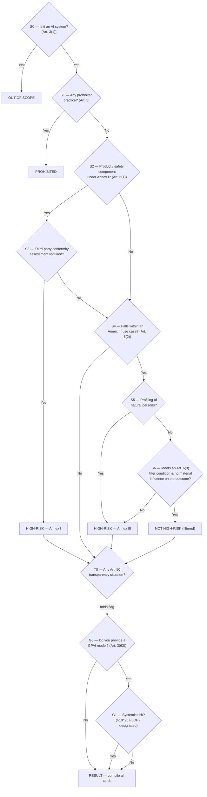

# Build spec — EU AI Act Risk-Tier Self-Assessment Tool

> **For the AI coding agent (e.g. Claude Code):** This document is a complete build brief. It is paired with `decision-tree.json`, which is the single source of truth for all questions, branching logic, reference lists (Annex III, Annex I, prohibited practices, Article 50 triggers) and result cards. **Do not hard-code the classification logic in your UI** — load it from `decision-tree.json` and drive the interface from it, so the content can be updated without touching the code. Read this spec end-to-end before writing code. Everything is in English (the tool's output language).

---

## 1. Goal and audience

Build an **online, browser-based self-assessment tool** that lets the owner of an algorithm or AI application answer a short series of questions and find out **which risk category of the EU AI Act (Regulation (EU) 2024/1689) their system falls into**.

The tool must cover the **full set of AI Act tiers**:

- **Out of scope** — not an AI system under Art. 3(1)
- **Prohibited** — unacceptable risk (Art. 5)
- **High-risk via Annex I** — Art. 6(1), regulated products
- **High-risk via Annex III** — Art. 6(2), listed use cases
- **Not high-risk (filtered)** — Annex III use case but exempted by the Art. 6(3) filter
- **Limited risk / transparency** — Art. 50 (cumulative with the tier above)
- **Minimal risk** — no mandatory obligations
- **GPAI model** and **GPAI model with systemic risk** — Art. 51–55 (a separate, model-level overlay)

Primary users are **non-lawyer product owners, compliance officers and developers** at organisations that build or deploy AI. The tone is plain, practical and reassuring, but every screen must be legally precise and cite the relevant article.

This is a **decision-support / triage tool, not legal advice.** The disclaimer (Section 9) must be visible.

---

## 2. Why this is not a single linear tree

A common mistake is to model the AI Act as one path ending in one leaf. It isn't. A single system can carry **three independent statuses at once**:

1. a **primary risk tier** (the SPINE),
2. **transparency obligations** under Art. 50 (cumulative — they sit on top of high-risk, filtered, or minimal), and
3. a **GPAI model status** (independent — a model can be a GPAI model *and* the system built on it can be high-risk).

So the tool accumulates **flags** as the user progresses and, at the end, renders **every applicable result card**. This structure is defined in `decision-tree.json → resultModel` and `moduleOrder`.

The flow runs four modules in order: **SPINE → TRANSPARENCY → GPAI → RESULT**, with two short-circuits: if the system is *not an AI system* it stops immediately; if it is *prohibited* the tier spine stops (prohibited overrides everything).

---

## 3. The decision flow

### 3.1 Diagram



### 3.2 The SPINE, step by step

The node IDs below map exactly to `decision-tree.json → nodes`.

1. **S0 — Is it an AI system? (Art. 3(1)).** The gate. The decisive element is *inference*: the system derives outputs (predictions, content, recommendations, decisions) from input, rather than executing only rules defined solely by humans. Show the `help.likelyYes` / `help.likelyNo` lists. **No → OUT_OF_SCOPE** (stop).
2. **S1 — Prohibited practice? (Art. 5).** Present the eight prohibited practices from `catalog.prohibitedPractices`. Any match → **PROHIBITED** (stop the tier spine).
3. **S2 — Annex I product or safety component? (Art. 6(1), first condition).** Is the AI itself a regulated product, or a safety component of one, under Annex I harmonisation legislation? Use `catalog.annexI_legislation` as a prompt list and explain the Art. 3(14) safety-component test (failure endangers health/safety, **or** fulfils a safety function; comfort/efficiency alone is not a safety function). **No → S4.**
4. **S3 — Third-party conformity assessment required? (Art. 6(1), second condition).** Both conditions are cumulative. If the product only needs internal self-assessment, it is **not** high-risk under Art. 6(1). **Yes → HIGH_RISK_ANNEX_I; No → S4.**
5. **S4 — Annex III use case? (Art. 6(2)).** Present all eight areas and their specific use cases from `catalog.annexIII`. Only the *listed use cases* count, not the broad area. Surface the horizontal notes ('natural persons' limitation, 'on behalf of', 'in so far as permitted…'). **No → T0** (transparency check).
6. **S5 — Profiling of natural persons?** If yes, the system is **always** high-risk and cannot use the filter → **HIGH_RISK_ANNEX_III.**
7. **S6 — Art. 6(3) filter.** The system is *not* high-risk if it meets at least one of the four conditions in `catalog.filterConditions` **and** does not materially influence the outcome (and is not part of a complex/agentic setup that does). **Yes → NOT_HIGH_RISK_FILTERED; No → HIGH_RISK_ANNEX_III.**

### 3.3 The TRANSPARENCY module (Art. 50)

**T0** runs for every non-prohibited, in-scope system (including high-risk ones). Present the four Art. 50 triggers from `catalog.transparencyTriggers` as a multi-select. If any is selected, set the `transparency` flag and remember which obligations were triggered. These are **cumulative** with the primary tier.

### 3.4 The GPAI module (Art. 51–55)

**G0** asks whether the user provides a general-purpose AI *model* (Art. 3(63)). If yes, **G1** asks about systemic risk (Art. 51: high-impact capabilities, presumed above 10^25 FLOP training compute, or Commission designation). Set the `gpai` flag to `gpai_model` or `gpai_model_systemic`. This is **independent** of the system tier — show it alongside whatever the SPINE produced.

### 3.5 RESULT

Compile the accumulated flags and render **all** applicable cards from `outcomes`:

- always the `primaryTier` card (one of OUT_OF_SCOPE / PROHIBITED / HIGH_RISK_ANNEX_I / HIGH_RISK_ANNEX_III / NOT_HIGH_RISK_FILTERED / MINIMAL_RISK);
- the `TRANSPARENCY` card **iff** the transparency flag is set and the tier is not out_of_scope/prohibited;
- the `GPAI_MODEL` or `GPAI_MODEL_SYSTEMIC` card **iff** the gpai flag is set.

**Deriving MINIMAL_RISK:** if the SPINE reached T0 without a high-risk or filtered outcome (i.e. S4 = No), the primary tier is `MINIMAL_RISK` **unless** the transparency flag is set — in which case the primary tier is still minimal but the transparency card is added. (Transparency is an overlay, not a tier; show MINIMAL_RISK + TRANSPARENCY together.)

---

## 4. Data contract (`decision-tree.json`)

| Key | What it is | How the UI uses it |
|---|---|---|
| `meta` | Title, version, regulation, purpose, disclaimer, sources, key dates | Header, footer, about box, disclaimer banner |
| `resultModel` | The three result dimensions + short-circuit rules | The accumulation/compile logic |
| `moduleOrder` | `["SPINE","TRANSPARENCY","GPAI","RESULT"]` | Module sequencing |
| `nodes` | Every question/result node, keyed by ID, with `text`, `explainer`, `help`, `articleRef`, `options[]` (each option has `label`, `value`, `next`), optional `checklist`/`reference` pointing into `catalog`, optional `setsFlag`/`setsGpai` | Renders each screen; `next` is either another node ID or an outcome ID |
| `outcomes` | Result cards keyed by ID: `tier`, `color`, `title`, `summary`, `obligations[]`, `legalRefs[]` | Result screen cards |
| `catalog.prohibitedPractices` | The 8 Art. 5 practices | S1 checklist |
| `catalog.annexI_legislation` | Annex I Section A + B prompt list | S2 reference panel |
| `catalog.filterConditions` | The 4 Art. 6(3) conditions + overrides | S6 checklist |
| `catalog.transparencyTriggers` | The 4 Art. 50 situations + per-item obligation | T0 multi-select |
| `catalog.annexIII` | 8 areas, each with `useCases[]` + horizontal notes | S4 selection panel |

**Colours** in `outcomes[].color`: `grey` (out of scope), `red` (prohibited), `orange` (high-risk), `yellow` (filtered), `green` (minimal), `blue` (transparency), `purple` (GPAI). Map these to an accessible palette.

---

## 5. UX requirements

- **One question per screen**, with a phase-based progress indicator (see **Section 5.1**, which is required) and a clear Back button. Keep the whole assessment to well under a dozen clicks for a typical system.
- Every screen shows: the question, a short plain-language `explainer`, the **article reference** (e.g. "Art. 6(2); Annex III"), and — where present — the `help.likelyYes` / `help.likelyNo` hints in a collapsible "Examples / how to decide" panel.
- **S1, S4, S6, T0 are list/checklist screens.** Render the catalog items with their legal refs. For S4 (Annex III) group by the eight areas and let the user expand each; selecting any use case = "Yes". For T0 allow multiple selections (they map to different obligations).
- **"I'm not sure" is a first-class answer.** Where a question is judgement-heavy (S0 inference, S2 safety component, S6 filter), offer a neutral path that treats uncertainty conservatively (assume the higher-risk branch) and flags the point for expert review in the result.
- **Result screen**: show all applicable cards, colour-coded, each with title, summary, the obligations list, legal references, and the relevant application date. Add a "what this means / next steps" note and prominent links to the AI Act Service Desk.
- **Answer trail**: show the path taken (question → answer) so the result is explainable and auditable.
- **Export**: let the user download a PDF/printable summary of their answers + result (useful evidence for the Art. 6(4) documentation duty in the filtered case). No account, no server storage.
- **Restart / edit answers** without losing earlier ones.

### 5.1 Progress visualisation (required)

**Design principle: anchor progress to the four phases, never to a question count.** The flow is branching and variable-length (an "out of scope" answer ends after one question, "prohibited" after two, a full run passes through the spine plus the transparency and GPAI overlays). A "step 3 of 10" bar or a percentage would be dishonest because the total is not fixed. Use the three components below together.

**A. Phase stepper (top of every screen).** A horizontal rail of four segments mapped 1:1 to `moduleOrder`:

1. *Scope & prohibitions* (nodes S0, S1)
2. *Risk tier* (nodes S2, S3, S4, S5, S6)
3. *Transparency* (node T0)
4. *GPAI* (nodes G0, G1)

Each segment has three states: **upcoming** (muted/outline), **current** (accent colour + subtle pulse or fill animation), **done** (filled + check icon). Derive the current segment from the active node's `module` field, which is present on every node in the JSON. Fill a segment the moment its last node is answered. When a short-circuit ends the run early (out of scope, prohibited), mark the remaining segments as *skipped* (a distinct greyed style with a small "n/a" label) rather than leaving them blank, so the user understands why the flow stopped. Keep the stepper compact on mobile (icons + short labels, or a collapsed "Phase 2 of 4: Risk tier" line).

**B. Live "verdict-so-far" panel (side panel on desktop, collapsible drawer on mobile).** This is the engagement driver: the user watches their own result take shape. Drive it entirely from the same `flags` object used for the compile logic (Section 7). As each answer is applied, append or update a line, for example:

- `✓ Is an AI system` (green check)
- `✓ Not a prohibited practice`
- `… Assessing high-risk (Annex III)` (in-progress, neutral) which resolves to `▲ High-risk — Annex III` once S5/S6 conclude
- `+ Transparency obligation added` when a T0 item is selected
- `◆ GPAI model (systemic risk)` when the GPAI overlay resolves

Use the tier colours from `outcomes[].color` for each line's marker so the panel visually previews the final result cards. Keep entries terse; the full explanation lives on the result screen. This panel is what makes progress feel like payoff rather than a chore.

**C. Answer-path timeline (result screen).** On the result screen, render the full path taken as a vertical timeline: each answered question with the chosen answer and its article reference, top to bottom, ending in the result cards. This doubles as the auditable, exportable record for the Art. 6(4) documentation duty (the filtered case) and gives the run a clear sense of completion.

**What to avoid:** fake percentages or a spinner that implies a known remaining length; a full decision-tree graph shown *during* the assessment (visually impressive but overwhelming). If you want a map view, offer it as an optional "show the decision map" toggle on the result screen only, highlighting the path taken.

### 5.2 Visual design language

- **Colour system:** use `outcomes[].color` as the semantic spine. Suggested accessible mapping (WCAG AA contrast, tune as needed): grey `#6B7280` (out of scope), red `#DC2626` (prohibited), orange `#EA580C` (high-risk), amber/yellow `#CA8A04` (filtered), green `#16A34A` (minimal), blue `#2563EB` (transparency), purple `#7C3AED` (GPAI). Always pair each colour with a text label and an icon (e.g. shield, ban, warning triangle, filter, check, eye, cube) so colour is never the only signal.
- **Motion:** short, calm transitions between screens (a 150 to 250 ms slide/fade), an ease on the stepper segment fill, and a gentle highlight when a new line appears in the verdict-so-far panel. Respect `prefers-reduced-motion` and disable non-essential animation when it is set.
- **Layout:** generous whitespace, one clear primary action per screen, a persistent Back control, and a two-column layout on desktop (question left, verdict-so-far panel right) collapsing to a single column with a drawer on mobile.
- **Typography & tone:** large readable question text, secondary muted explainer text, monospace or chip styling for article references (e.g. a small `Art. 6(2)` chip). Plain, calm, professional.

### 5.3 State the components read from

All three progress components are pure functions of state already defined in Section 7. No extra data model is needed:

- **Phase stepper** reads `nodes[currentNodeId].module` (and the set of modules already completed).
- **Verdict-so-far panel** reads `flags` (`primaryTier`, `transparency[]`, `gpai`) plus a running list of resolved milestones.
- **Answer-path timeline** reads the `answers[]` trail.

---

## 6. Technical guidance

- **Preferred deliverable: a single self-contained `index.html`** (inline CSS + JS, no build step) that fetches or embeds `decision-tree.json`. This makes it trivial to host anywhere (static hosting, intranet) and to open locally. If the JSON is embedded, keep it in a clearly-marked `<script type="application/json">` block so it stays editable. **Do not use `localStorage`/`sessionStorage`** if this will run as a Claude artifact — keep state in memory.
- If the owner prefers a framework, React + Vite is fine; keep the same data contract and keep it a static SPA. State can live in a single reducer over `{ currentNodeId, answers[], flags: {primaryTier, transparency:[], gpai} }`.
- **No back-end and no PII collection.** The assessment must run entirely client-side. Do not transmit answers anywhere.
- **Accessibility**: WCAG 2.1 AA — keyboard navigable, proper focus management between screens, ARIA for the progress and checklists, colour is never the only signal (pair each tier colour with a label/icon).
- **Internationalisation-ready**: keep all display strings coming from the JSON so a Dutch (or other) translation can be added later as a parallel JSON without code changes.
- **Versioning**: display `meta.version` and `meta.lastUpdated` in the footer, because the underlying guidelines are still draft and will change.

---

## 7. Accumulation logic (pseudo-code)

```js
let node = "S0_ai_system";
const flags = { primaryTier: null, transparency: [], gpai: "none" };

while (nodes[node].type === "question") {
  const answer = ask(nodes[node]);           // user picks an option (or multi-select)
  applySideEffects(nodes[node], answer, flags); // setsFlag / setsGpai / record transparency items
  node = resolveNext(nodes[node], answer);   // an outcome ID or the next node ID
  if (isOutcome(node)) {                       // SPINE reached a terminal tier
    flags.primaryTier = node;                  // e.g. HIGH_RISK_ANNEX_III
    if (node === "OUT_OF_SCOPE") return render([outcomes.OUT_OF_SCOPE]);
    if (node === "PROHIBITED")  { node = "G0_gpai"; continue; } // still note GPAI, skip transparency
    node = "T0_transparency";                  // continue into overlays
  }
}
// node === "RESULT": if no primaryTier set by SPINE terminal, it is MINIMAL_RISK
if (!flags.primaryTier) flags.primaryTier = "MINIMAL_RISK";
render(compileCards(flags));                   // primary + transparency? + gpai?
```

`compileCards` returns the primary card, plus `TRANSPARENCY` if `flags.transparency.length` and tier ∉ {out_of_scope, prohibited}, plus the matching GPAI card if `flags.gpai !== "none"`.

---

## 8. Acceptance test scenarios

Build these as sanity checks; each lists inputs → expected result cards.

1. **CV-screening / recruitment ML** — AI system: yes; not prohibited; not Annex I; Annex III 4(a): yes; profiling: yes → **HIGH_RISK_ANNEX_III**.
2. **Credit-scoring for individuals** — Annex III 5(b), profiling yes → **HIGH_RISK_ANNEX_III**. (For company-only creditworthiness → not this use case → likely MINIMAL_RISK.)
3. **Customer-service chatbot (general)** — not Annex III; T0 50(1) yes → **MINIMAL_RISK + TRANSPARENCY**.
4. **Document-deduplication step inside a visa-processing pipeline** — Annex III 7(c) area, but S6 filter 6(3)(a) narrow procedural task, no profiling, no material influence → **NOT_HIGH_RISK_FILTERED** (+ Art. 6(4) documentation reminder).
5. **AI lane-assistance in a car** — Annex I (vehicles), safety component, third-party CA required → **HIGH_RISK_ANNEX_I**.
6. **Emotion recognition in a workplace** — S1 Art. 5(1)(f) → **PROHIBITED**.
7. **Large language model provider, >10^25 FLOP** — G0 yes, G1 yes → GPAI overlay = **GPAI_MODEL_SYSTEMIC** (plus whatever tier its offered system has).
8. **Spreadsheet with fixed formulas** — S0 no → **OUT_OF_SCOPE**.
9. **Text-to-image generator, general use** — not Annex III; T0 50(2) yes → **MINIMAL_RISK + TRANSPARENCY**; if the provider is also the model provider, add GPAI overlay.

---

## 9. Legal accuracy and disclaimer (must appear in the tool)

- Reproduce `meta.disclaimer` prominently (start screen + result screen). Key points: **non-binding, indicative, not legal advice; classification is the provider's responsibility supervised by the market surveillance authority; only the CJEU can give an authoritative interpretation.**
- State clearly that this is based on the **draft** Commission classification guidelines (stakeholder-consultation versions) plus the AI Act text, and that details may change. Show `meta.lastUpdated`.
- Show the **application dates** from `meta.keyDates` on the relevant result cards (note the AI Omnibus postponements: Annex III high-risk → 2 Dec 2027; Annex I high-risk → 2 Aug 2028; prohibitions already apply since Feb 2025; GPAI rules since Aug 2025; transparency from Aug 2026). Flag these as indicative and subject to change.
- Link to the **AI Act Service Desk / Single Information Platform** and recommend expert/legal review for borderline cases (especially S0 inference, S2 safety component, and the S6 filter).

---

## 10. Sources encoded in the tool

- Regulation (EU) 2024/1689 (AI Act): Arts. 3, 5, 6, 7, 50, 51, 53, 55; Annexes I, III.
- Commission Guidelines on the definition of an AI system, C(2025) 5053.
- Draft Commission guidelines on the classification of high-risk AI systems under Article 6 (general principles; Annex I; Annex III) — stakeholder-consultation drafts.
- Annex III reference: https://artificialintelligenceact.eu/annex/3/

---

### Build order suggestion for the coding agent

1. Load and validate `decision-tree.json` against the contract in Section 4.
2. Implement the node-driven screen renderer (question / checklist / result screen types).
3. Implement the flag accumulation + `compileCards` logic (Section 7).
4. Wire the catalog-driven checklists (S1, S2, S4, S6, T0).
5. Build the three progress components from Section 5.1 (phase stepper, live verdict-so-far panel, answer-path timeline), all driven from `module` / `flags` / `answers[]`.
6. Build the result screen with multi-card rendering, answer trail and PDF export.
7. Apply the Section 5.2 visual design language (colour system, motion, layout).
8. Add the disclaimer, sources, application dates and Service Desk links.
9. Run the Section 8 scenarios as tests, including that the stepper skips/marks phases correctly on the out-of-scope and prohibited short-circuits.
10. Polish accessibility (`prefers-reduced-motion`, ARIA for stepper and checklists) and styling; keep it a single static file if possible.
